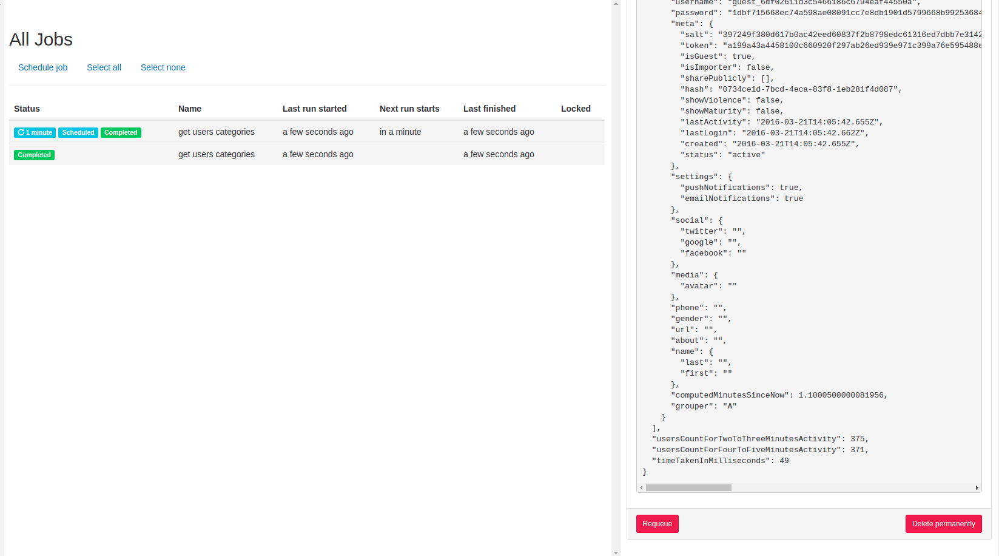
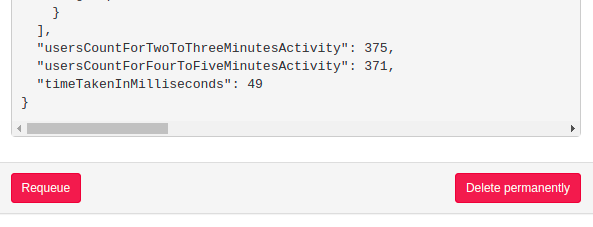

## Optimize User Categorization Task

First of all enjoyed this task a lot. It was really interesting and fun to code. 

### How to run code 
1. Load data into db. You can update the db credentials in the script `backup/restore.sh` and run it.

1. configure credentials in `config/local.yml` copied from `config/default.yml`
1. `npm i`

1. `node index.js`

1. visit `localhost:3000` and you will see a UI that will tell you: 

On the UI you will see the output of the job, time taken by single job to run, and status of the job ( failed or completed ). The job runner is very robust and jobs persists in database even if you restart the app and is set to run every 1 minute. The average time it takes to compute the results is around 50ms. Attached is a sample of image from UI you will see. In the second image you can see the `timeTakenInMilliseconds` to compute user categories. 

### Run through docker container

`docker-compose up -d`

### Comments
I heavily relied on mongo aggregation and restrained from loading the documents into the memory and compute the results there as the job runs every minute and if the data is increased to 500K, that approach will have performance issues
### Improvements 

I think instead of loading the user categories into the memory, it should be streamed to redis but since it is a simple demo task, I added the comments there and loaded them in memory for display purposes. Also for displaying purposes I query for the whole documents at the end of aggregation pipeline using `$$ROOT`. I think it can also be replaced with `emails` along with respective notifications to send.